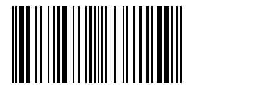

Barcode
-------
De- and encodes barcodes of type EAN.
Experimantal, but, basically works for EAN- Codes of the type ISBN. Still needs a lot of refractoring to be done (Especially the code doing the decoding). 

